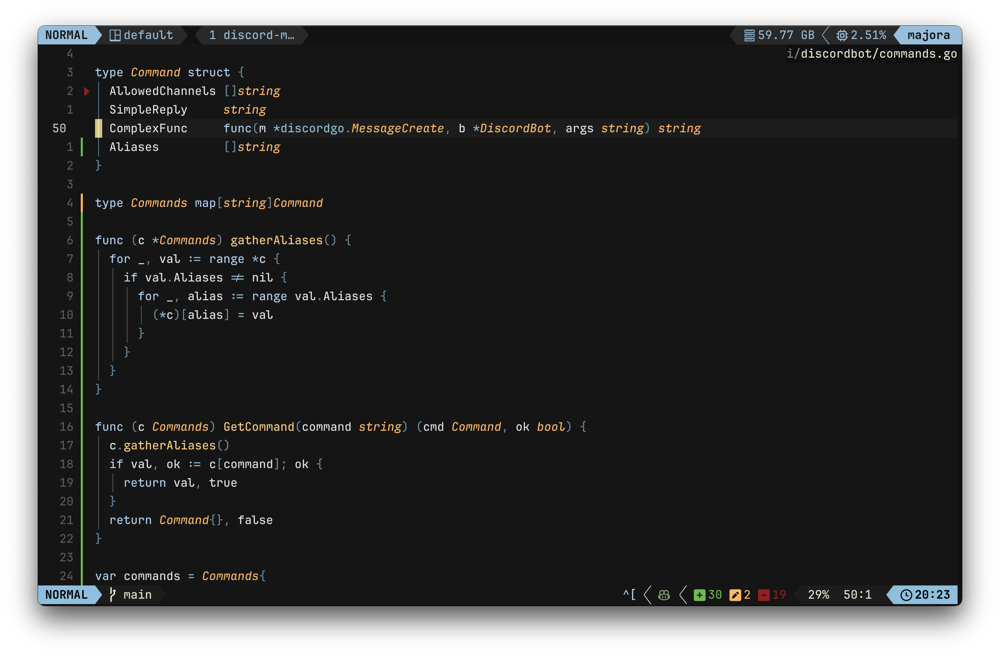
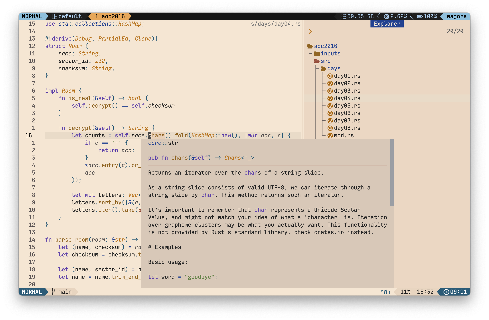

# 🟣 Jellybeans.nvim

A port of the jellybeans colorscheme for Neovim, written in Lua.

**Note:** This colorscheme is very much a work in progress so breaking changes should be expected. If you find any issues, please report them. I don't have a lot of experience with colorschemes so pull requests are welcome.




## ✨ Features

- Written in Lua
- Treesitter support
- LSP support
- [Support for popular plugins](https://github.com/WTFox/jellybeans.nvim/tree/main/lua/jellybeans/groups)

## 📦 Installation

Using [lazy.nvim](https://github.com/folke/lazy.nvim):

```lua
{
    "wtfox/jellybeans.nvim",
    priority = 1000,
    config = function()
        require("jellybeans").setup()
        vim.cmd.colorscheme("jellybeans")
    end,
}
```

## Configuration Defaults

```lua
{
  style = "dark", -- "dark" or "light"
  transparent = false,
  italics = true,
  plugins = {
    all = false,
    auto = true, -- will read lazy.nvim and apply the colors for plugins that are installed
  },
  on_highlights = function(highlights, colors)
  end,
}
```

### Lualine

The theme includes a [Lualine](https://github.com/nvim-lualine/lualine.nvim) theme. To enable it:

```lua
require('lualine').setup {
    options = {
        theme = 'jellybeans'
    }
}
```

## 🔌 Extras Support

- FZF
- Wezterm
- Windows Terminal
- Yazi
- and [more...](https://github.com/WTFox/jellybeans.nvim/tree/main/extras)

## Inspirations

- [jellybeans.vim](https://github.com/nanotech/jellybeans.vim)

## Acknowledgements

- [tokyonight.nvim](https://gitub.com/folke/tokyonight.nvim) by [Folke](https://githubcom/folke)
- [jellybeans-nvim](https://github.com/metalelf0/jellybeans-nvim) by [metalelf0](https://github.com/metalelf0)
- [jbeans](https://github.com/scajanus/jbeans) by [scajanus](https://github.com/scajanus)
