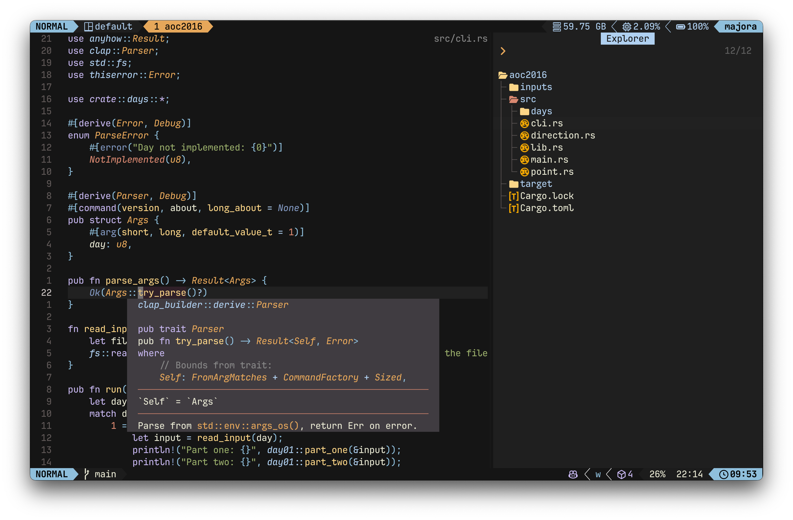

# 🟣 Jellybeans.nvim

A port of the jellybeans colorscheme for Neovim, written in Lua.





## ✨ Features

- Written in Lua
- Highly configurable
- Treesitter support
- LSP support
- [Support for popular plugins](https://github.com/WTFox/jellybeans.nvim/tree/main/lua/jellybeans/groups)

## 📦 Installation

Using [lazy.nvim](https://github.com/folke/lazy.nvim):

```lua
{
  "wtfox/jellybeans.nvim",
  lazy = false,
  priority = 1000,
  opts = {},
}
```

```lua
vim.cmd[[colorscheme jellybeans]]
```

## 🛠️ Configuration

Jellybeans ships with the following defaults

```lua
{
  style = "dark", -- "dark" or "light"
  transparent = false,
  italics = true,
  flat_ui = true, -- toggles "flat UI" for pickers
  plugins = {
    all = false,
    auto = true, -- will read lazy.nvim and apply the colors for plugins that are installed
  },
  on_highlights = function(highlights, colors)
  end,
  on_colors = function(colors)
  end,
}
```

You can easily override the color palette. For example, here's how to change the background color:

```lua
  opts = {
    on_colors = function(c)
      local light_bg = "#ffffff"
      local dark_bg = "#000000"
      c.background = vim.o.background == "light" and light_bg or dark_bg
    end,
  }
```

If you want more control over highlight groups, that is also possible:

```lua
  opts = {
    on_highlights = function(hl, c)
      hl.Constant = { fg = "#00ff00", bold = true }
    end,
  },
```

### Lualine

The theme includes a [Lualine](https://github.com/nvim-lualine/lualine.nvim) theme. To enable it:

```lua
require('lualine').setup {
    options = {
        theme = 'jellybeans'
    }
}
```

## 🔌 Extras Support

- FZF
- Ghostty
- Wezterm
- Windows Terminal
- Yazi
- and [more...](https://github.com/WTFox/jellybeans.nvim/tree/main/extras)

## 💕 Inspirations

- [jellybeans.vim](https://github.com/nanotech/jellybeans.vim)
- [tokyonight.nvim](https://github.com/folke/tokyonight.nvim) by [Folke](https://githubcom/folke)
- [jellybeans-nvim](https://github.com/metalelf0/jellybeans-nvim) by [metalelf0](https://github.com/metalelf0)
- [jbeans](https://github.com/scajanus/jbeans) by [scajanus](https://github.com/scajanus)

## 🤝 Contributors

<a href="https://github.com/wtfox/jellybeans.nvim/graphs/contributors">
  
</a>

Made with [contrib.rocks](https://contrib.rocks).

## 🌟 Star History

<a href="https://star-history.com/#wtfox/jellybeans.nvim&Date">
 <picture>
   <source media="(prefers-color-scheme: dark)" srcset="https://api.star-history.com/svg?repos=wtfox/jellybeans.nvim&type=Date&theme=dark" />
   <source media="(prefers-color-scheme: light)" srcset="https://api.star-history.com/svg?repos=wtfox/jellybeans.nvim&type=Date" />
   
 </picture>
</a>
